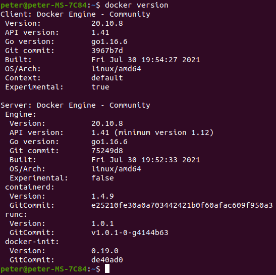
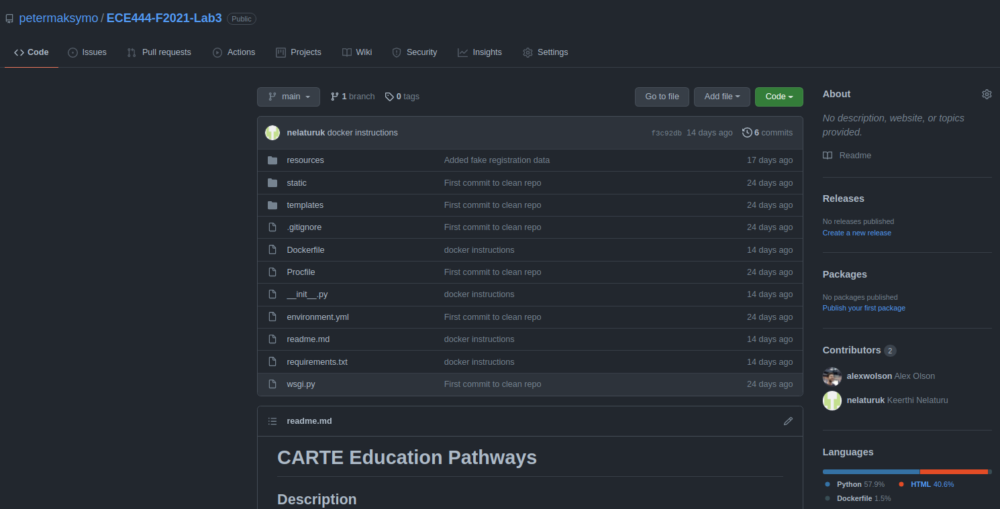
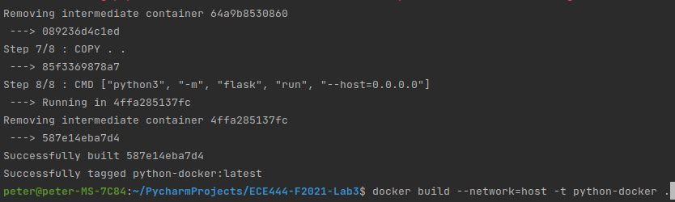
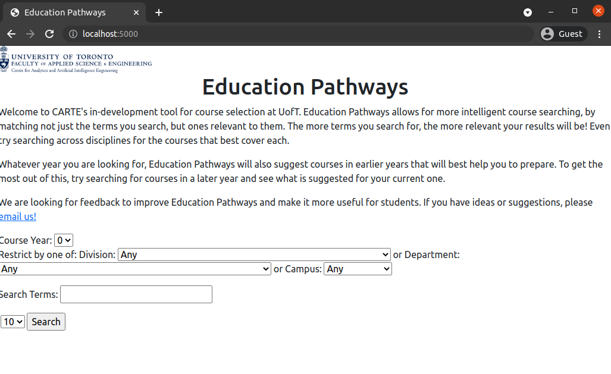

# Peter Maksymowsky
* this repo is a clone of [https://github.com/nelaturuk/education_pathways](https://github.com/nelaturuk/education_pathways
)

## Activity 1

## Activity 2

## Activity 3
*note, only the last few steps are screenshotted as the whole command created a lot of output logs related to downloading dependencies

## Activity 4

## Activity 5

### Functional Requirement - Course Rating System
As an end user, I would like to rate courses and see course ratings, so that I can make a more informed decision when choosing perspective courses. A simple course rating system would allow students to express their opinions about courses they took as well as see what other students through about courses at a glance. It would also be useful for the University to gauge the quality of the courses.

This could be implemented with a simple 5 star system where users could enter a rating. They could then see the average rating for each course based off of how many out of 5 stars are filled out.

### Non-Functional Requirement - Usability

The usability of the current site is poor. The site is not responsive meaning that there is no mobile-optimized design. Also the overal design of the site is very drab and detracts from the content. For instance, there is very little space between columns in the search results making it hard to differentiate the data and determine which column it is a part of. It is because of reasons like this that I think improving the usability of the site is paramount. 

# CARTE Education Pathways

## Description
Welcome to CARTE's in-development tool for course selection at UofT. Education Pathways allows for more intelligent course searching, by matching not just the terms you search, but ones relevant to them. The more terms you search for, the more relevant your results will be! Even try searching across disciplines for the courses that best cover each.

Whatever year you are looking for, Education Pathways will also suggest courses in earlier years that will best help you to prepare. To get the most out of this, try searching for courses in a later year and see what is suggested for your current one.

We are looking for feedback to improve Education Pathways and make it more useful for students. If you have ideas or suggestions, please email us!

## Setup Instructions

### With Docker

## Repository files:

`./Procfile ./wsgi.py` *tells gunicorn how to run the program*

`./environment.yml  ./requirements.txt` *specifies python requirements for anaconda and pip respectively*

`./__init__.py` *main flask code*

`./readme.md` *this file*

`./resources:` *contains datasets used in the program*

`course_vectorizer.pickle df_processed.pickle`

`course_vectors.npz       graph.pickle`

`./static:` *contains any static elements of the webpage, in this case just the CARTE logo*
`CARTE_logo.jpg`

`./templates:` *contains flask templates for rendering HTML*

`_formhelpers.html course.html       index.html        results.html`
